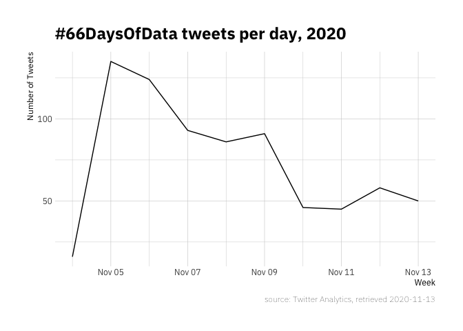
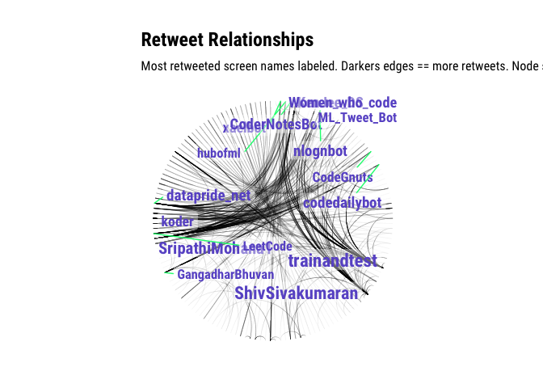

66daysofdata
================
Duncan Gates
11/13/2020

## Tweets over Time

Unfortunately the Twitter API limits scraping to just the last week, but
there are a total of 743 engagements over the last week (including
retweets, 319 engagements). Assuming a similar engagement rate over the
previous 59 days we get about ~6000 total tweets including retweets, or
~2700 not including\!

<!-- -->

## Wordcloud of Data

## User Retweet Network

Basic network that labels the screen names of the most retweets over the
\#66daysofdata hashtag.

<!-- -->
